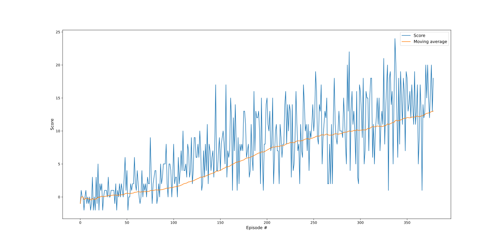

# Project 1: Navigation - Report

In this project, I've used the Deep Q-Learning algorithm to train an Agent to navigate (and collect bananas!) in a large, square world.

This report will describe the learning algorithm, model architecture for the neural network, along with the chosen hyper-parameters.

## Learning Algorithm

The whole learning algorithm is based on three critical parts: Deep Q-Network, Experience Replay, and the use of Epsilon-Greedy action selection.

### Deep Q-Network

In order to solve this challenge, I have implemented [Deep Q-Network](https://storage.googleapis.com/deepmind-media/dqn/DQNNaturePaper.pdf).

#### Model Architecture

Since the state space has 37 dimensions and contains the agent's velocity, along with a ray-based perception of objects around an agent's forward direction. There are four discrete actions are available, corresponding to:

- **`0`** - move forward.
- **`1`** - move backward.
- **`2`** - turn left.
- **`3`** - turn right.

The input layer consists of `37` nodes and the output of `4` nodes. The Neural Network has two hidden layers, the first one with `128` and the second one with `64` nodes with ReLU activation.

```jupyterpython
QNetwork(
  (model): Sequential(
    (fc0): Linear(in_features=37, out_features=128, bias=True)
    (relu0): ReLU()
    (fc1): Linear(in_features=128, out_features=64, bias=True)
    (relu1): ReLU()
    (fc2): Linear(in_features=64, out_features=4, bias=True)
  )
)
```

### Experience Replay (a.k.a Replay Buffer)

Same as in [Deep Q-Network](https://storage.googleapis.com/deepmind-media/dqn/DQNNaturePaper.pdf) paper, I've implemented Experience Replay. This technique allows to accumulate experiences in the replay-buffer and gives an advantage of more efficient use of previous experience, by learning with it multiple times. 

### Epsilon-Greedy Action Selection

Also, I've leveraged Epsilon-Greedy action selection. Epsilon-Greedy is a simple method to balance exploration and exploitation by choosing between exploration and exploitation randomly.
The epsilon-greedy, where epsilon refers to the probability of choosing to explore, exploits most of the time with a small chance of exploring. 

I've set the value of epsilon to `0.9` and gradually multiply by `0.985` until it reaches`0.02`.

### Hyperparameters

It's technically impossible to find the most performant hyper-parameters by hand. Thus I've left the majority of the hyperparameters the same that I've used in the Deep Q-Networks lesson exercise.

```python
BUFFER_SIZE = int(1e5)  # replay buffer size
BATCH_SIZE = 64  # minibatch size
GAMMA = 0.99  # discount factor
TAU = 1e-3  # for soft update of target parameters
LR = 5e-4  # learning rate
UPDATE_EVERY = 4  # how often to update the network
```

## Plot of Rewards

The plot below illustrates the scores and scores moving average (of last 100 episodes) that the agent received during the training process.



It took 379 episodes for the agent to receive an average reward (over 100 episodes) of at least +13.

```jupyter
Episode 100	Average Score: 1.42
Episode 200	Average Score: 7.03
Episode 300	Average Score: 10.11
Episode 379	Average Score: 13.02
Environment solved in 279 episodes!	Average Score: 13.02
```

> Note: The actual results might fluctuate drastically every training cycle. Also, the printed results say that the environment was solved in 279 episodes, because 100 is discounted when printing that line. 

## Ideas for Future Improvements

There are numerous ways how it would be possible to further improve the learning algorithm. However, it depends whether the goal is to reach an average reward (over 100 episodes) of at least +13 faster or generally improve the agent's ability to score better.

Some of the obvious ways to improve the learning algorithm would:
- Implement [Double DQN](https://arxiv.org/abs/1509.06461) technique
- Change the Neural Network architecture to [Dueling DQN](https://arxiv.org/abs/1511.06581)
- Try out [Noisy Networks for Exploration](https://arxiv.org/abs/1706.10295)
- Use [Prioritized Experienced Replay](https://arxiv.org/abs/1511.05952) instead of Experience Replay

Besides that, there a lot of room for hyperparameters improvement. It would be possible to automatically find the best hyperparameters to improve the learning process and the agent's performance.
