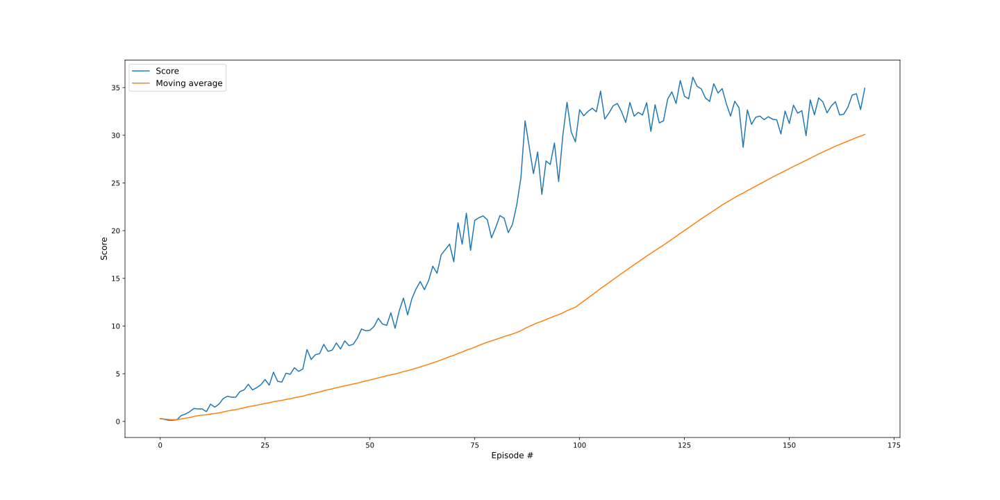

# Project 2: Continous control - Report

In this project, I've used the DDPG algorithm to train an Agent, a double-jointed, to move to a target locations. A reward of +0.1 is provided for each step that the agent's hand is in the goal location. Thus, the goal of your agent is to maintain its position at the target location for as many time steps as possible.

This report will describe the learning algorithm, model architecture for the neural network, along with the chosen hyper-parameters.

## Learning Algorithm

I've used the 2nd version of the Unity environment that contains 20 identical agents, each with its own copy of the environment.

The barrier for solving the second version of the environment is slightly different, because we need to take into account the presence of many agents. So here agents must get an average score of +30 (over 100 consecutive episodes, and over all agents).

### Deep Deterministic Policy Gradient

In order to solve this challenge, I have implemented [DDPG](https://arxiv.org/pdf/1509.02971.pdf) algorithm.

#### Model Architecture

The observation space consists of `33` variables corresponding to position, rotation, velocity, and angular velocities of the arm. Each action is a vector with four numbers, corresponding to torque applicable to two joints. And every entry in the action vector is a number between `-1` and `1`.

Thus the input layer for the Actor and Critic consists of `33` nodes and the output of `4` nodes for the Actor and `1` node for the Critic. 

The Actor's Neural Network has two hidden layers, the first one with `256` and the second one with `128` nodes. I've also applied Batch normalization.

```jupyterpython
Actor(
  (fc1): Linear(in_features=33, out_features=256, bias=True)
  (fc2): Linear(in_features=256, out_features=128, bias=True)
  (fc3): Linear(in_features=128, out_features=4, bias=True)
  (bn): BatchNorm1d(33, eps=1e-05, momentum=0.1, affine=True, track_running_stats=True)
)
```

The Critic's Neural Network has three hidden layers, the first one with `256`, the second one with `128`, and the third with `64` node. Same as for the Actors, I've also applied Batch normalization.

```jupyterpython
Critic(
  (fcs1): Linear(in_features=33, out_features=256, bias=True)
  (fc2): Linear(in_features=260, out_features=128, bias=True)
  (fc3): Linear(in_features=128, out_features=64, bias=True)
  (fc4): Linear(in_features=64, out_features=1, bias=True)
  (bn): BatchNorm1d(33, eps=1e-05, momentum=0.1, affine=True, track_running_stats=True)
)
```

### Experience Replay (a.k.a Replay Buffer)

Same as in [Deep Q-Network](https://storage.googleapis.com/deepmind-media/dqn/DQNNaturePaper.pdf) paper, I've implemented Experience Replay. This technique allows to accumulate experiences in the replay-buffer and gives an advantage of more efficient use of previous experience, by learning with it multiple times.

To make the training process a bit faster, every time I've sampled 3 experiences from the memory.


### Hyperparameters

It's technically impossible to find the most performant hyper-parameters by hand. Thus I've left the majority of the hyperparameters the similar to the ones used in DDPG lessons excersices.

```python
BUFFER_SIZE = int(1e6)  # replay buffer size
BATCH_SIZE = 128        # minibatch size
GAMMA = 0.99            # discount factor
TAU = 1e-3              # for soft update of target parameters
LR_ACTOR = 1e-3         # learning rate of the actor
LR_CRITIC = 1e-4        # learning rate of the critic
WEIGHT_DECAY = 0        # L2 weight decay
MU = 0                  # Ornstein-Uhlenbeck noise MU parameter
THETA = 0.15            # Ornstein-Uhlenbeck noise THETA parameter
SIGMA = 0.2             # Ornstein-Uhlenbeck noise SIGMA parameter
LEARN_PASSES = 3        # number of learning passes from memory
```

## Plot of Rewards

The plot below illustrates the scores and scores moving average (of last 100 episodes) that the agent received during the training process.



It took 169 episodes for the agent to receive an average reward (over 100 episodes) of at least +30.

```jupyter
Episode 100 	Score: 29.31 	Average Score: 11.97
Episode 169 	Score: 34.93	Average Score: 30.08
Environment solved in 169 episodes!	Average Score: 30.08
```

> Note: The actual results might fluctuate drastically every training cycle.

## Ideas for Future Improvements

There are numerous ways how it would be possible to further improve the learning algorithm. However, it depends whether the goal is to reach an average reward (over 100 episodes) of at least +30 faster or generally improve the agent's ability to score better.

Some of the obvious ways to improve the learning algorithm would:
- Implement [Proximal Policy Optimization](https://arxiv.org/pdf/1707.06347.pdf) algorithms
- Try [Distributed Distributional Deterministic Policy Gradients](https://arxiv.org/pdf/1804.08617.pdf)
- Use [Prioritized Experienced Replay](https://arxiv.org/abs/1511.05952) instead of Experience Replay

Besides that, there a lot of room for hyperparameters improvement. It would be possible to automatically find the best hyperparameters to improve the learning process and the agent's performance.
