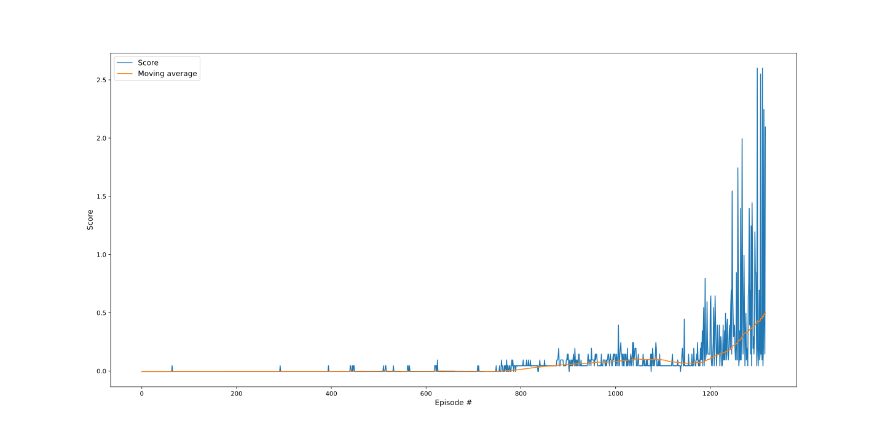

# Project 2: Continous control - Report

In this project, I've used the DDPG algorithm to train two agents to control rackets to bounce a ball over a net. If an agent lets a ball hit the ground or hits the ball out of bounds, it receives a reward of -0.01.  Thus, the goal of each agent is to keep the ball in play.

This report will describe the learning algorithm, model architecture for the neural network, along with the chosen hyper-parameters.

## Learning Algorithm

I've used the Tennis Unity environment with 2 identical agents playing tennis against one another. This environment is considered solved, when the average (over 100 episodes) of those **scores** is at least +0.5.

### Deep Deterministic Policy Gradient

In order to solve this challenge, I have implemented [DDPG](https://arxiv.org/pdf/1509.02971.pdf) algorithm.

#### Model Architecture

The observation space consists of 8 variables corresponding to the position and velocity of the ball and racket. Each agent receives its own, local observation. Two continuous actions are available, corresponding to movement toward (or away from) the net, and jumping. 

Thus the input layer for the Actor and Critic consists of `24` nodes and the output of `2` nodes for the Actor and `1` node for the Critic. 

The Actor's Neural Network has two hidden layers, the first one with `512` and the second one with `256` nodes. I've also applied Batch normalization.

```jupyterpython
Actor(
  (fc1): Linear(in_features=24, out_features=512, bias=True)
  (fc2): Linear(in_features=512, out_features=256, bias=True)
  (fc3): Linear(in_features=256, out_features=2, bias=True)
  (bn): BatchNorm1d(24, eps=1e-05, momentum=0.1, affine=True, track_running_stats=True)
)
```

The Critic's Neural Network has three hidden layers, the first one with `514`, the second one with `256`, and the third with `128` node. Same as for the Actors, I've also applied Batch normalization.

```jupyterpython
Critic(
  (fcs1): Linear(in_features=24, out_features=512, bias=True)
  (fc2): Linear(in_features=514, out_features=256, bias=True)
  (fc3): Linear(in_features=256, out_features=128, bias=True)
  (fc4): Linear(in_features=128, out_features=1, bias=True)
  (bn): BatchNorm1d(24, eps=1e-05, momentum=0.1, affine=True, track_running_stats=True)
)
```

### Experience Replay (a.k.a Replay Buffer)

Same as in [Deep Q-Network](https://storage.googleapis.com/deepmind-media/dqn/DQNNaturePaper.pdf) paper, I've implemented Experience Replay. This technique allows to accumulate experiences in the replay-buffer and gives an advantage of more efficient use of previous experience, by learning with it multiple times.

To make the training process a bit faster, every time I've sampled 3 experiences from the memory.

### Hyperparameters

It's technically impossible to find the most performant hyper-parameters by hand. However, I've noticed that the agents learn better when using lower SIGMA and THETA value for Ornstein-Uhlenbeck noise. Also, increased batch size to 1024 seemed to help in the learning process too.

```python
BUFFER_SIZE = int(1e6)  # replay buffer size
BATCH_SIZE = 128        # minibatch size
GAMMA = 0.99            # discount factor
TAU = 1e-3              # for soft update of target parameters
LR_ACTOR = 1e-3         # learning rate of the actor
LR_CRITIC = 1e-4        # learning rate of the critic
WEIGHT_DECAY = 0        # L2 weight decay
MU = 0                  # Ornstein-Uhlenbeck noise MU parameter
THETA = 0.15            # Ornstein-Uhlenbeck noise THETA parameter
SIGMA = 0.2             # Ornstein-Uhlenbeck noise SIGMA parameter
LEARN_PASSES = 3        # number of learning passes from memory
```

## Plot of Rewards

The plot below illustrates the scores and scores moving average (of last 100 episodes) that the agent received during the training process.



It took 1317 episodes for the agents to receive an average reward (over 100 episodes) of at least +0.5.

```jupyter
Episode 100	Score: -0.005 	Average Score: -0.004
Episode 200	Score: -0.005 	Average Score: -0.005
Episode 300	Score: -0.005 	Average Score: -0.004
Episode 400	Score: -0.005 	Average Score: -0.004
Episode 500	Score: -0.005 	Average Score: -0.002
Episode 600	Score: -0.005 	Average Score: -0.001
Episode 700	Score: -0.005 	Average Score: -0.002
Episode 800	Score: 0.045 	Average Score: 0.0130
Episode 900	Score: 0.095 	Average Score: 0.056
Episode 1000	Score: 0.145 	Average Score: 0.081
Episode 1100	Score: 0.045 	Average Score: 0.095
Episode 1200	Score: 0.145 	Average Score: 0.103
Episode 1300	Score: 2.600 	Average Score: 0.431
Episode 1317	Score: 2.095	Average Score: 0.506
Environment solved in 1317 episodes!	Average Score: 0.51
```

> Note: The actual results might fluctuate drastically every training cycle.

## Ideas for Future Improvements

There are numerous ways how it would be possible to further improve the learning algorithm. 

Some of the ways to improve the learning algorithm:
- Implement [Proximal Policy Optimization](https://arxiv.org/pdf/1707.06347.pdf) algorithms
- Use [Prioritized Experienced Replay](https://arxiv.org/abs/1511.05952) instead of Experience Replay
- Try out other noise process algorithms
- Try changing hyperparamers gradually during training process

Besides that, there a lot of room for hyperparameters improvement. It would be possible to automatically find the best hyperparameters to improve the learning process and the agent's performance.
